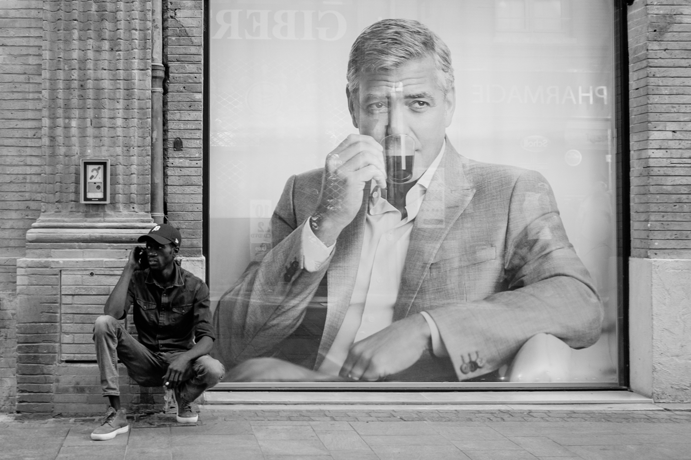
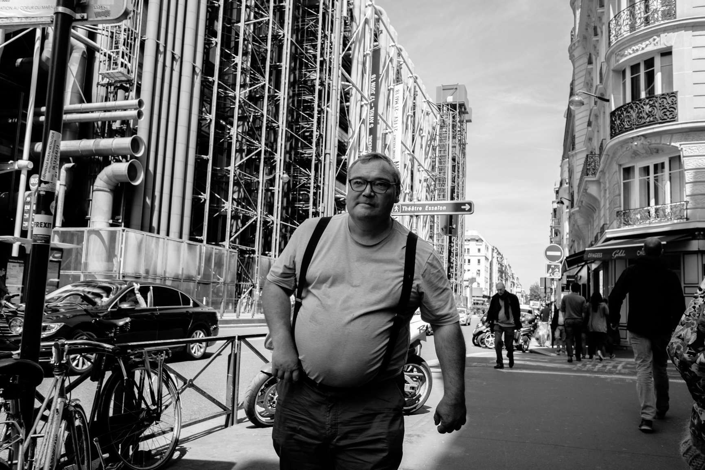
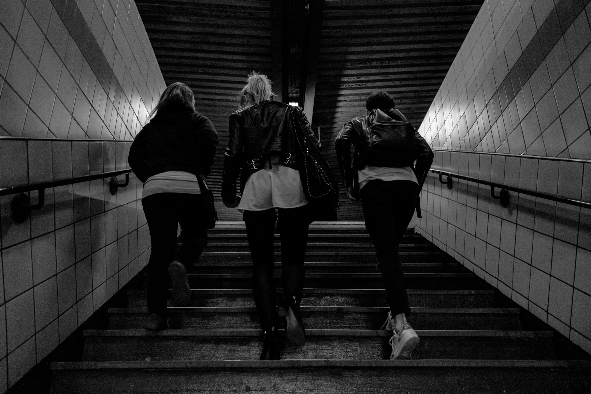

Au 1er Janvier 2018 je me suis donné comme challenge de publier une photo du jour chaque jour de l’année sur mon blog.

J’appelle ce projet **2018 en 365 photos**.

#### Mon objectif

Faire la meilleure photo du jour dont je suis capable. Travailler mes aptitudes en matière de photo de rue le plus possible. Passer l’inhibition lorsque je me prépare à photographier une personne inconnue. Et surtout conforter l’habitude du regard photographique. En revanche ne jamais mettre quiconque en mauvaise posture ni photographier des enfants que je ne connais pas.

#### Une photo par jour

Chaque photographe doit travailler son regard. J’ai l’habitude d’avoir un appareil photo sur moi depuis plusieurs années déjà. Utiliser le même boîtier avec la même optique sur une longue période créent des réflexes de cadrage.

C’est la raison pour laquelle j’utilise le Fuji X70. Petit et léger, on peut l’utiliser en automatique comme en manuel en un clin d’oeil. J’apprécie particulièrement son aspect jouet et sa simplicité d’utilisation. Je suis tombé amoureux du rendu des couleurs et surtout son noir et blanc ‘so Fuji’.

Une photo par jour sur un an c’est ambitieux alors la technique ne doit pas être un but ni un bloquage donc avec ce boitier je suis servi.
Libre de contrainte technique et du poids d’un boîtier encombrant je n’ai plus d’excuses. Je peux tenir l’année !

#### Publier sur ce blog

En publiant mes photos sur sur une page privée j’ai pu recevoir régulièrement les impressions de mes amis. En me forçant à faire cela j’ai créé un engagement personnel qui m’a fait tenir toute l’année. Un an c’est long ! Mais à chaque rappel ou remarque de mes amis j’ai un regain d’énergie qui me pousse à aller plus loin, tester de nouvelles manières de faire. Merci Gabrielle et Syrah, le feed-back ça aide énormément !

On m’a souvent demandé mon Instagram. Je ne me voyais pas me mettre en concurrence avec les professionnels du HashTag sur cette plateforme. Je préfère utiliser mon temps pour la photographie. Voici [mon compte Instagram](https://www.instagram.com/rfonzarely/), peut être je succomberai à l'appel des HashTags.

#### Statistiques

- 328 photos prises et publiées, au lieu de 365 prévues,
- 30 photos sélectionnées,
- 365 jours de kiff photographique.

- Beaucoup d'énergie de Janvier à Juin.
- Juillet et Août, l'été Parisien m'inspire.
- Septembre à Novembre, difficile de se renouveler.
- Décembre, je me force à tenir mon projet.

#### Ce que j'ai appris

**Photo de rue** : A force de photographier des inconnus j’ai dépassé ma peur. Une fébrilité s’installait et me bloquait. J’avais surtout peur de me faire engueuler ou cogner. Cela n’est jamais arrivé.

**Style** : J’aime le noir et blanc plus que je ne le pensais. La rue, ou les photos candides, est mon domaine. Je retrouve mes premiers amours de la photos, ces photos que l'on développe à la lueur d'une lampe olive. Revoir ces clichés en noir et blanc sont comme des souvenir que l'on doit découvrir à nouveau.

**Développement** : Entre 5 minutes et une heure chaque jour. C’est le temps moyen que je donne au projet. Je remarque que les moments où je reste constant je m’améliore et si je laisse passer quelques jours pour développer mes photos je perds ma motivation et je ne suis pas du tout satisfait de mes prises.

**Et après** : Je veux l’instant à la Cartier Bresson. Une photo par jour c’est peu et beaucoup à la fois. Avec l’excitation des débuts je n’ai eu aucun mal à le faire de janvier à juin, par la suite ce fût plus compliqué car j’ai eu du mal à renouveler mes idées. Pour durer je vais me concentrer sur des projets plus courts et plus restreints.

Ce que je garde de cette experience est d’avoir présenté mes photos journalièrement, quelqu’en soit leurs qualités, et c’est une nouveauté.

Le patron d’un bar a exposé une des photos sur plusieurs mois. Cela m’a fait plaisir de voir qu’on aimait cette photo au point de la garder si longtemps. Et pourquoi pas exposer ma prochaine série dans mon bar préféré ? C’est à méditer.
