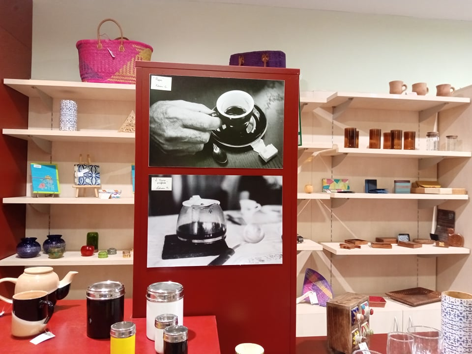

C'est avec une grande joie que j'apprends que ma photo proposée au concours De la Graine à la Terrasse par Artisans du monde a obtenu le premier prix.
C'est le premier concours auquel j'ose participer et cela me donne envie de proposer mes photos à d'autres.

\- Papa -

Les photos selectionnées vont être exposées durant six mois au 14 rue de la Bombarde à Lyon.

Je remercie Artisans du monde pour l'organisation de ce concours et l'exposition. Vous êtes adorables, Merci !

\- Annonce sur Facebook -

\- Photo de l'exposition -

https://www.artisansdumonde.org/

14 rue de la Bombarde à Lyon
